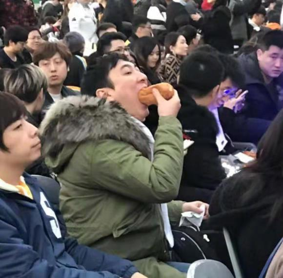
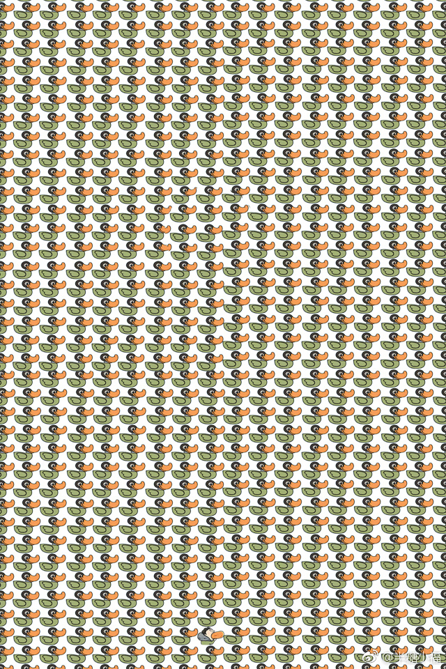
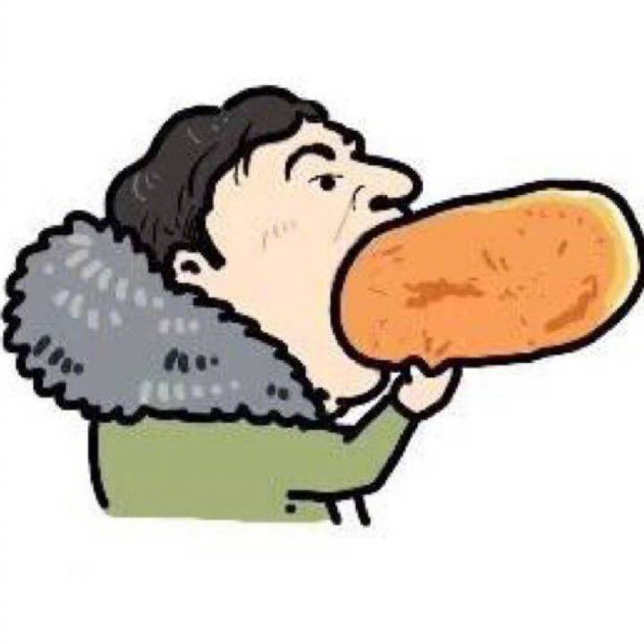
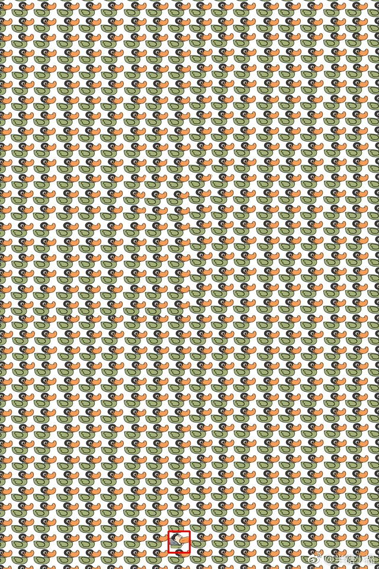

<div align=center></div>


# 3秒找出王思聪都能上热搜？呵呵，0.03秒就可以

IG 夺冠啦！你们的王校长又双叒叕火啦！连吃热狗都吃的如此销魂，那我们当然要来在人群中找到他呢！

看到一个美术生的作品，如何 `3` 秒内找到思聪王。


我找了好久啊，这幅图画的真是魔性，看得眼睛都花了，浪费了我宝贵的上班时间。不得不承认，我，作为一个工科生，`3` 秒钟是找不到了。但是，我的电脑可以呀！

连美术生都出动调侃王思聪了，工科生怎么能坐以待毙！那我就趁着上班，来做一个自动找王思聪的实现吧。

既然在上班，就要用一种比较专业的方式来展开我的工作。

**项目目标:** 在一群鸭子中找到 吃热狗的 王思聪

**项目实现:** Python ，OpenCV

**项目成果:** `0.3` 秒内找到

**项目技术路线:**

1. 获得鸭子同等大小的王思聪；

2. 在原图全局搜索，匹配王思聪所在的位置；

3. 在王思聪周围画个红框；

4. 查看计算机速度；

**项目具体实现:**

图像处理，作为计算机算法中十分大的一类，现成的代码库中有一个非常适合用来做

## 1. 获得鸭子同等大小的王思聪 —— `resize` (OpenCV)

这个部分主要是数据的预处理，说得很专业，其实就是用电脑自带的截图工具，截取一个小鸭子，他的大小大约为 `36*36`。我们就相应地把王思聪 resize 到和小鸭子同等大小，这里采用了插值 `'inter_cubic'` 的方式来进行重采样。



```python
#!/usr/bin/env python3
# -*- coding: utf-8 -*-
"""
Created on Wed Nov  7 11:42:02 2018

@author: aaron
"""

import cv2

template = cv2.imread('img/wangsicong.jpg')
template = cv2.resize(template, (36, 36), interpolation=cv2.INTER_CUBIC)
```
## 2. 在原图全局搜索，匹配王思聪所在的位置 —— `matchTemplate` (OpenCV)
OpenCV 作为一个比较全能的图像处理库，能够提供较为许多图像处理的基础，比如边缘监测函数可以直接用于监测图像的边界（OpenCV 也提供了 canny 算子、sobel 算子等）。

这里我们使用 模版匹配算法（matchTemplate），他帮助算法在一副图像中找到特定的目标。该函数需要四个参数，
- 原图 Image
- 监测目标 detect
- 匹配结果图 result
- 匹配衡量方式 method
- CV_TM_SQDIFF，平方差
- CV_TM_SQDIFF_NORMED，平方差归一化
- CV_TM_CCORR，相关度
- CV_TM_CCORR_NORMED，相关度归一化
- CV_TM_CCOEFF，相关系数
- CV_TM_CCOEFF_NORMED，相关系数归一化
因此，该搜索主要是以像素级别的匹配，不会进行缩放；

我们目前的任务中王思聪的色调并没有改变，因此任何一种方法的差异并不是很大。

```python
img = cv2.imread('img/ducks.jpg')

# Get Size of Template
w, h = template[:,:,0].shape[::-1] 

# Apply template Matching
res = cv2.matchTemplate(img, template, eval('cv2.TM_CCOEFF'))
```
## 3. 在王思聪周围画个红框 —— `minMaxLoc` (OpenCV)；
matchTemplate 函数得到的结果是一个灰度数值图，给出的是图像中每一个 detect 范围的匹配程度，灰度数值越大，则相似度越高。

为了画出这个最有可能出现思聪王的位置，我们使用 OpenCVv 的 minMaxLoc 函数来得到思聪王边框的具体位置，并进一步使用 OpenCV 的 rectangle 函数来画出这个框。
```python
from matplotlib import pyplot as plt

# Get Anchor for the Template Matching Result
min_val, max_val, min_loc, max_loc = cv2.minMaxLoc(res)

# Draw Rectangle
top_left = max_loc
bottom_right = (top_left[0] + w, top_left[1] + h)
imgplt = cv2.cvtColor(img, cv2.COLOR_BGR2RGB)
cv2.rectangle(imgplt,top_left, bottom_right, 255, 2)

# Show Image
plt.imshow(imgplt)
plt.title('Detected results'), plt.xticks([]), plt.yticks([])
plt.show()
```


结果如上！成功！

## 4. 计算机的速度 —— `timeit`
```python
import timeit
start = timeit.default_timer()

# Your Statement Here

stop = timeit.default_timer()
print('Time: ', stop - start)
```

我平均跑了十次，2018 年款的 mac air，基本配置的平均时间是 0.2 秒！

目标达成！

PS，👆是为了展示一下 OpenCV 的风采。因此使用了传统的模式匹配流程。如果我们在实际应用中，面对雷同的问题。

1. 首先分析认为，王思聪的脸部颜色和鸭子不一样，且他的脸部颜色只有他独有的；
2. 可以使用 滴管 功能来得到 王思聪脸部颜色的 RGB；
3. 在图中搜索有 脸部颜色 RGB 的部分 并 高亮；
4. 找到 王思聪！

在最终的[脚本](./wangsicong.py)中，我们整理了所有代码，调整了部分顺序。


OpenCV 是 **计算机视觉** 中非常重要的类库，他既可以支持传统计算机视觉处理，也可以支持 **深度学习计算机视觉**。他的底层是 C++，运算速度很快，也提供了 Python 的调用接口，真的省了很多事呢！
